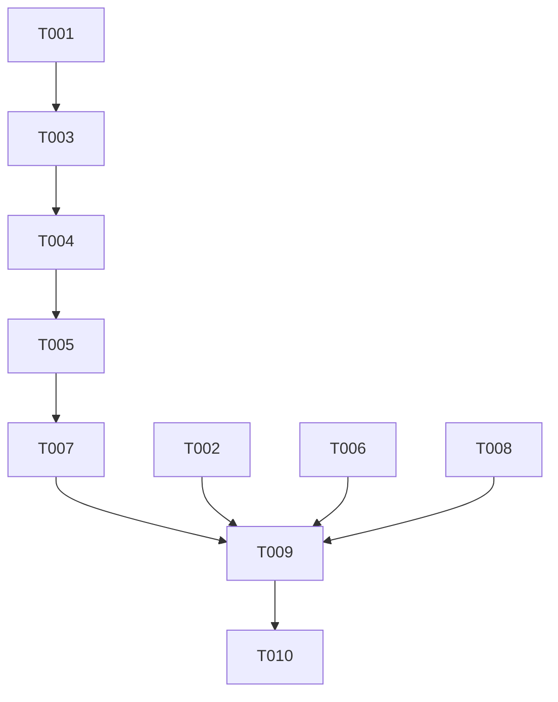

# Tasks: Mock AI Service Integration

**Feature**: Mock AI Service Integration  
**Branch**: `023-mock-ai-service`  
**Plan**: [specs/023-mock-ai-service/plan.md](plan.md)

## Phase 1: Setup

- [x] T001 Create directory `backend/src/services/providers/`
- [x] T002 [P] Remove `openai` dependency from `backend/package.json`

## Phase 2: Foundational (Interface & Base Class)

- [x] T003 Create `AiProvider` base class in `backend/src/services/providers/aiProvider.js`
- [x] T004 [P] Create unit test for `MockAiProvider` in `backend/tests/unit/mockAiProvider.test.js`

## Phase 3: User Story 1 - System Functionality with Mock AI

**Goal**: Implement mock AI logic that returns deterministic responses.  
**Independent Test**: Verify `MockAiProvider` returns expected JSON for curation and text for subjects.

- [x] T005 [US1] Implement `MockAiProvider` in `backend/src/services/providers/mockAiProvider.js`
- [x] T006 [P] [US1] Update `backend/tests/unit/aiService.test.js` to work with the mock provider

## Phase 4: User Story 2 - Seamless Future Integration

**Goal**: Refactor `AiService` to use the provider pattern.  
**Independent Test**: `AiService` functions correctly without direct `openai` imports.

- [x] T007 [US2] Update `AiService` in `backend/src/services/aiService.js` to use `MockAiProvider`
- [x] T008 [P] [US2] Verify prompt resolution still works in `backend/tests/unit/aiService_templates.test.js`

## Phase 5: Polish & Verification

- [x] T009 Run all backend tests to ensure no regressions
- [x] T010 [P] Remove any unused OpenAI-related configuration or imports across the backend

## Dependency Graph

## Parallel Execution Examples

- **Phase 1 & 2**: T001 and T002 can run in parallel.
- **Phase 3**: T006 can be prepared while T005 is in progress.
- **Phase 4**: T008 can run independently of T007.

## Implementation Strategy

1. **MVP (US1)**: Focus on getting the `MockAiProvider` working and tested independently.
2. **Incremental Delivery (US2)**: Refactor `AiService` to use the provider. This ensures we don't break existing logic while removing the dependency.
3. **Verification**: Comprehensive testing ensures the system is stable without the external library.
