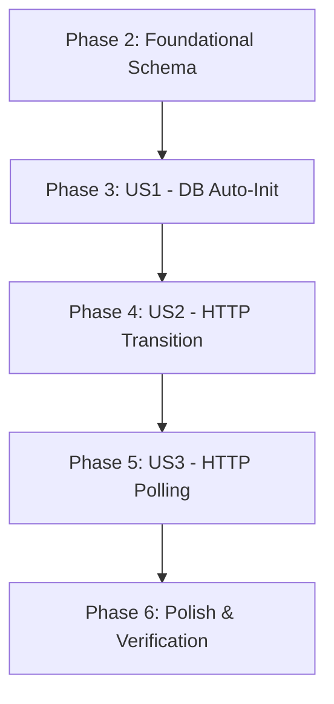

# Tasks: Infrastructure Reliability and Communication Update

**Feature**: Infrastructure Reliability and Communication Update
**Plan**: [plan.md](plan.md)
**Status**: Completed

## Dependency Graph

## Parallel Execution Examples

- **[US1]**: Database initialization logic can be developed while simultaneously updating the `schema.sql`.
- **[US3]**: The backend polling endpoints (`/api/proxy/tasks`) can be implemented in parallel with the proxy-service client updates.

---

## Phase 1: Setup

Goal: Initialize the development environment and shared configurations.

- [X] T001 Create `backend/src/api/proxy.js` for new polling endpoints
- [X] T002 Update `backend/src/config/env.js` to include `PROTOCOL` and `POLLING_INTERVAL` defaults

## Phase 2: Foundational

Goal: Update the database schema to support task persistence.

- [X] T003 Update `backend/src/db/schema.sql` to include `proxy_tasks` table and updated AI presets
- [X] T004 [P] Create unit test for schema validation in `backend/tests/unit/db.test.js`

## Phase 3: [US1] Database Auto-Initialization

Goal: Ensure the application starts cleanly without manual database steps.

- **Story Goal**: Automatically create tables and seed default data on startup.
- **Independent Test**: Delete `dev.db`, start backend, verify `ai_subject_presets` exist.

- [X] T005 [P] [US1] Create unit tests for DB initialization in `backend/tests/unit/init.test.js`
- [X] T006 [US1] Implement table existence check and `schema.sql` execution in `backend/src/db/index.js`
- [X] T007 [US1] Implement seeding logic for `ai_subject_presets` in `backend/src/db/index.js`
- [X] T008 [US1] Update `backend/src/server.js` to call initialization before starting the server

## Phase 4: [US2] Transition to HTTP

Goal: Enable easy reverse proxy integration by serving over HTTP.

- **Story Goal**: Serve backend traffic via HTTP instead of HTTPS by default.
- **Independent Test**: Access backend via `http://localhost:3080` successfully.

- [X] T009 [US2] Modify `backend/src/server.js` to use `http.createServer` instead of `https.createServer`
- [X] T010 [US2] Update `backend/src/middleware/errorHandler.js` if any protocol-specific logic exists
- [X] T011 [US2] Update `frontend/src/api/` base URL configuration to support HTTP backend
- [X] T012 [US2] Remove/Disable SSL cert requirement in `backend/src/config/env.js`

## Phase 5: [US3] HTTP Polling for Proxy Service

Goal: Robust communication in restricted environments.

- **Story Goal**: Replace WebSockets with HTTP polling for proxy-to-backend communication.
- **Independent Test**: Disable WS in proxy, verify it still receives collection tasks via logs.

- [X] T013 [P] [US3] Create integration tests for proxy polling in `backend/tests/integration/proxy.test.js`
- [X] T014 [US3] Implement `GET /api/proxy/tasks` endpoint in `backend/src/api/proxy.js`
- [X] T015 [US3] Implement `POST /api/proxy/update` endpoint in `backend/src/api/proxy.js`
- [X] T016 [US3] Update task creation logic in `backend/src/api/trends.js` to insert into `proxy_tasks`
- [X] T017 [US3] Replace WebSocket client in `proxy-service/src/client.js` with `setInterval` polling using `axios`
- [X] T018 [US3] Map WS message handlers to HTTP POST requests in `proxy-service/src/client.js`

## Phase 6: Polish & Verification

Goal: Ensure performance and stability.

- [X] T019 Implement a health check endpoint `/api/health` in `backend/src/server.js` that reports DB status
- [X] T020 [P] Conduct a full end-to-end test of the collection flow using the `quickstart.md` guide
- [X] T021 Clean up unused WebSocket service files in `backend/src/services/websocket/`