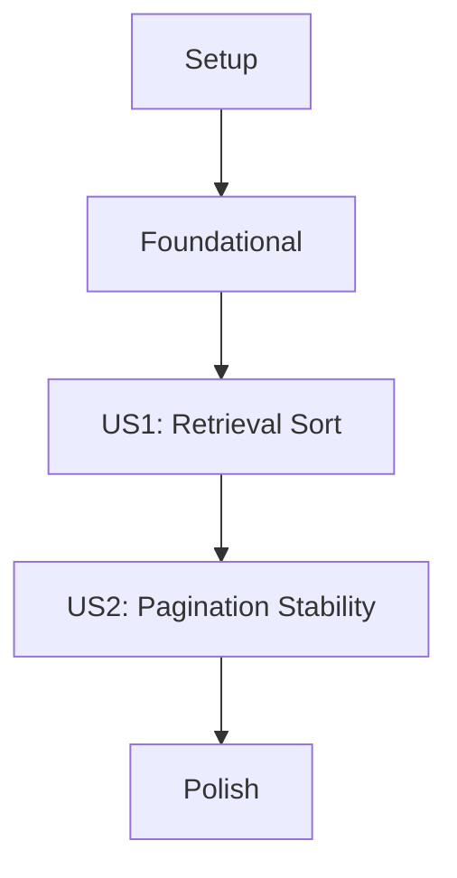

# Tasks: Dashboard Chronological Sort

**Feature Name**: Dashboard Chronological Sort
**Implementation Plan**: [plan.md](plan.md)
**Feature Spec**: [spec.md](spec.md)

## Implementation Strategy

This feature will be implemented incrementally, starting with ensuring data consistency (ISO8601) and performance (indexing). The core logic will then be updated to enforce the descending chronological sort order at the database level, followed by verification of pagination stability.

1.  **Foundational**: Ensure all new items are stored with ISO8601 timestamps and indexed for performance.
2.  **MVP (US1)**: Update the retrieval logic to return items in `published_at DESC` order.
3.  **Stability (US2)**: Add a secondary sort key (`id DESC`) to ensure deterministic pagination.

## Dependency Graph

## Parallel Execution Examples

- **[US1]**: Unit tests for sort order can be developed in parallel with the model implementation if using mock data.
- **[Foundational]**: Adding the index to `schema.sql` and `migrate.js` can happen in parallel with updating the `TrendItemModel.create` logic.

---

## Phase 1: Setup

Goal: Initialize feature-specific context and verification environment.

- [x] T001 Create baseline unit test for `TrendItemModel.getAll` in `backend/tests/unit/trendItemModel.test.js`

## Phase 2: Foundational

Goal: Ensure data consistency and performance prerequisites.

- [x] T002 Ensure `published_at` is always converted to ISO8601 string in `backend/src/models/trendItemModel.js`
- [x] T003 [P] Verify `idx_trend_items_published_at` index exists in `backend/src/db/schema.sql`

## Phase 3: [US1] View Latest Trends (Priority: P1)

Goal: Implement descending chronological sort for the main dashboard feed.

- **Story Goal**: Users see the newest content at the top of the dashboard.
- **Independent Test Criteria**: `GET /api/trends` returns items where `published_at` of item N is greater than or equal to item N+1.
- **Tests**: `backend/tests/unit/trendItemModel.test.js`

- [x] T004 [US1] Update `TrendItemModel.getAll` to enforce `ORDER BY t.published_at DESC` in `backend/src/models/trendItemModel.js`
- [x] T005 [P] [US1] Create integration test to verify API sort order in `backend/tests/api/trends.test.js`

## Phase 4: [US2] Consistent Pagination (Priority: P2)

Goal: Ensure stable and deterministic pagination during active data collection.

- **Story Goal**: "Load more" functionality works seamlessly without skipping or duplicating items.
- **Independent Test Criteria**: Successive calls with `OFFSET` return a continuous, non-overlapping sequence of items.
- **Tests**: `backend/tests/unit/trendItemModel.test.js`

- [x] T006 [US2] Add `t.id DESC` as a secondary sort key to `TrendItemModel.getAll` query in `backend/src/models/trendItemModel.js`
- [x] T007 [US2] Update unit tests to verify stability with identical timestamps in `backend/tests/unit/trendItemModel.test.js`

## Phase 5: Polish & Cross-Cutting Concerns

Goal: Final verification and documentation.

- [x] T008 [P] Verify performance of sorted query with 1000+ items in `backend/tests/performance/sort_performance.test.js`
- [x] T009 Final review of `TrendItemModel.js` for adherence to style and TDD principles
